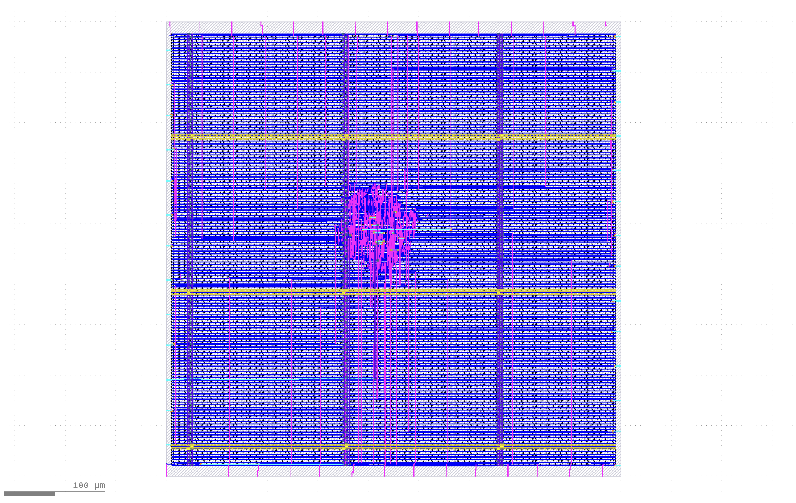
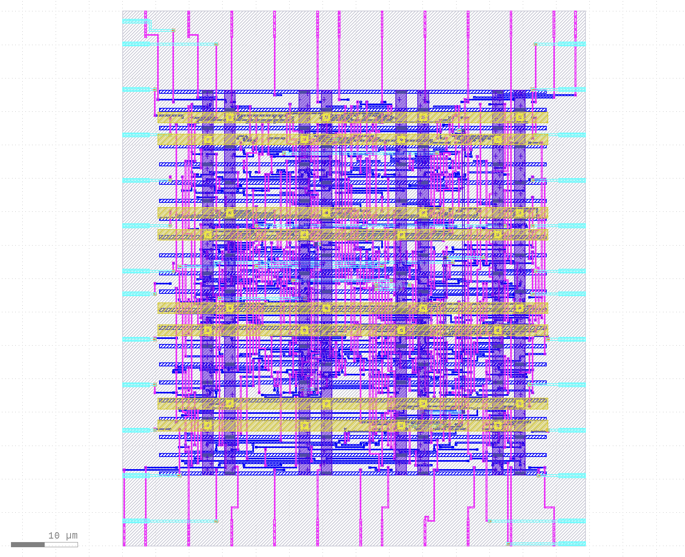
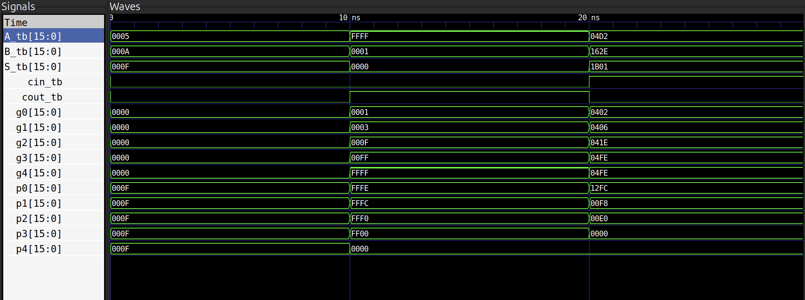

# 16-Bit High-Performance ALU: A Physical Design Study (RCA vs. KSA)

## Project Overview
This project explores the fundamental PPA (Power, Performance, Area) trade-offs in digital logic by implementing and optimizing two distinct 16-bit Adder architectures: a **Ripple Carry Adder (RCA)** and a **Kogge-Stone Adder (KSA)**. 

Using the **OpenLane** automated RTL-to-GDSII flow and the **Sky130 PDK**, I performed an iterative physical design analysis. The study tracks the journey from a sparse RCA baseline to a highly optimized KSA tree, which was pushed to a peak frequency of **335.6 MHz**.

## Technical Stack
* **HDL:** Verilog (Structural & Behavioral)
* **PDK:** SkyWater 130nm (Sky130)
* **Synthesis & PnR:** OpenLane, Yosys
* **Static Timing Analysis (STA):** OpenSTA
* **Physical Verification:** KLayout, Magic (DRC/LVS)
* **Simulation:** Icarus Verilog, GTKWave

---

## 01. Ripple Carry Adder (RCA) - Baseline Analysis
The RCA served as our control group. While structurally simple, the physical implementation required six iterations to overcome routing congestion and legalization errors before achieving a stable, dense baseline.

### **RCA Optimization Matrix**
| Iteration | Primary Objective | Key `config.json` Changes | Cell Count | Die Area ($\mu m^2$) | WNS (Slack) | Result & Engineering Observations |
| :--- | :--- | :--- | :--- | :--- | :--- | :--- |
| #1 | Baseline | Default Settings | 313 | $500 \times 500$ | $+1.20$ | **Success:** Functional, but layout was too sparse. |
| #2 | Area Compaction | `FP_CORE_UTIL: 50` | 313 | $400 \times 400$ | N/A | **FAILED:** Routing congestion at slice boundaries. |
| #3 | Density Stress | `PL_TARGET_DENSITY: 0.6` | 313 | $400 \times 400$ | N/A | **FAILED:** Legalization errors; cells packed too tightly. |
| #4 | Max Frequency | `CLOCK_PERIOD: 5.0` | 436 | $450 \times 450$ | $-1.40$ | **FAILED:** Timing violation. RCA hit physical wall at 200MHz. |
| #5 | Area Minimization | `SYNTH_STRATEGY: AREA` | 305 | $450 \times 450$ | $-0.35$ | **FAILED:** Logic paths too slow for 133MHz target. |
| **#6** | **Optimized PPA** | **`CLOCK_PERIOD: 7.5`** | **436** | **$450 \times 450$** | **$+0.71$** | **SUCCESS: Final Golden Run. Stable 133.3MHz.** |

---

## 02. Kogge-Stone Adder (KSA) - High-Speed Optimization
The KSA uses a parallel-prefix tree to calculate carries in $O(\log_2 N)$ time. This section documents the push for maximum performance, navigating the trade-offs between power and frequency.

### **KSA Optimization Matrix**
| Iteration | Objective | Strategy | Area ($\mu m^2$) | WNS (Slack) | $f_{max}$ | Total Power |
| :--- | :--- | :--- | :--- | :--- | :--- | :--- |
| #1 | Baseline | `AREA 0` | 6,241 | +1.46 | 220.2 MHz | 136 $\mu W$ |
| #2 | Performance | `DELAY 3` | 5,134 | +0.11 | 323.6 MHz | 314 $\mu W$ |
| #3 | Limit Test | `DELAY 3` | 6,118 | **-0.10** (Fail) | 322.6 MHz | 324 $\mu W$ |
| #4 | Speed Demon | `DELAY 3` | 6,118 | +0.05 | 327.9 MHz | 324 $\mu W$ |
| #5 | Efficiency | `DELAY 1` | 5,554 | +0.18 | 331.1 MHz | 322 $\mu W$ |
| **#6** | **The Final Peak** | **`DELAY 1`** | **5,554** | **+0.02** | **335.6 MHz** | **344 $\mu W$** |

---

## Final Performance Comparison
The results demonstrate the massive performance gain achievable through architectural optimization. By moving from the RCA baseline to the KSA tree, **frequency was increased by 151%**.

| Metric | RCA (Baseline #6) | KSA (Golden #6) | Delta |
| :--- | :--- | :--- | :--- |
| **Max Frequency ($f_{max}$)** | 133.3 MHz | **335.6 MHz** | **+151%** |
| **Data Arrival Time** | 5.63 ns | **2.98 ns** | **-47% Delay** |
| **Setup Slack** | +0.71 ns | **+0.02 ns** | Peak Optimization |
| **Total Power** | $\approx 136\ \mu W$ | 344 $\mu W$ | +152% |

---

## Project Visuals

### Physical Layout (GDSII)
The KLayout captures illustrate the architectural shift: the RCA shows a linear placement of slices, while the KSA highlights the dense routing density of the parallel-prefix tree.




### Functional Verification
Verification was performed via gate-level simulation (GLS) using Icarus Verilog. The KSA waveform explicitly tracks the five levels of internal generate (g0–g4) and propagate (p0–p4) signals, confirming architectural integrity.



---

## Repository Structure
* **`/01_RCA_Baseline_Area`**: RCA source code, netlists, and the 6-iteration optimization reports.
* **`/02_KSA_Optimized_Timing`**: KSA source code and performance-optimized sign-off files.

---

## How to Reproduce

To reproduce these results, you must have the **OpenLane** toolchain installed. 

1. **Clone the repository** into your OpenLane `designs/` folder:
   ```bash
   cd [path-to-openlane]/designs
   git clone [https://github.com/mokshith777/16-Bit-ALU-Physical-Design-Analysis.git](https://github.com/mokshith777/16-Bit-ALU-Physical-Design-Analysis.git)

2. **Navigate back to the OpenLane root directory:
   ```bash
   cd ..
  
3. **Run the flow for the designed architecture:

   For the KSA Golden Run:
    ```bash
     ./flow.tcl -design 16-Bit-ALU-Physical-Design-Analysis/02-KSA-Optimized -tag golden_run
    ```

   For the RCA Baseline:
    ```bash
     ./flow.tcl -design 16-Bit-ALU-Physical-Design-Analysis/01-RCA-Baseline -tag baseline_run 
    ```

# Final Engineering Note

This project represents a complete **RTL-to-GDSII flow**. The KSA implementation successfully pushed the **Sky130 PDK** to a timing-critical limit (+0.02 ns slack), providing a high-performance ALU core suitable for speed-oriented digital system.


   
